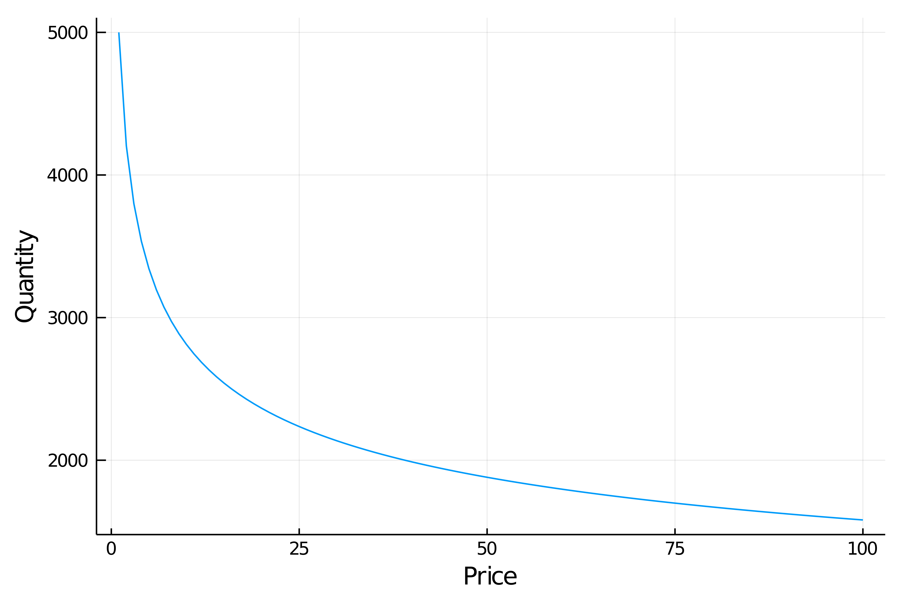
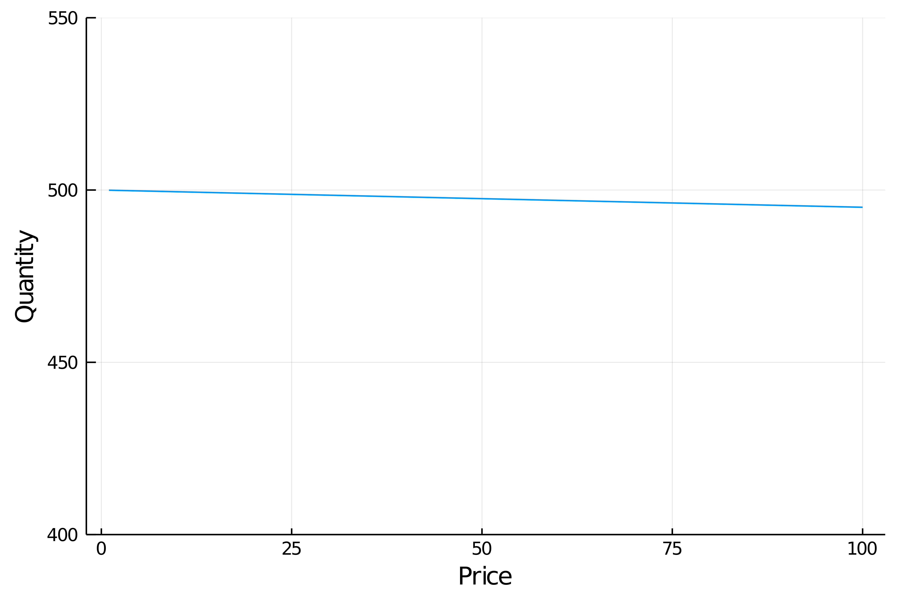
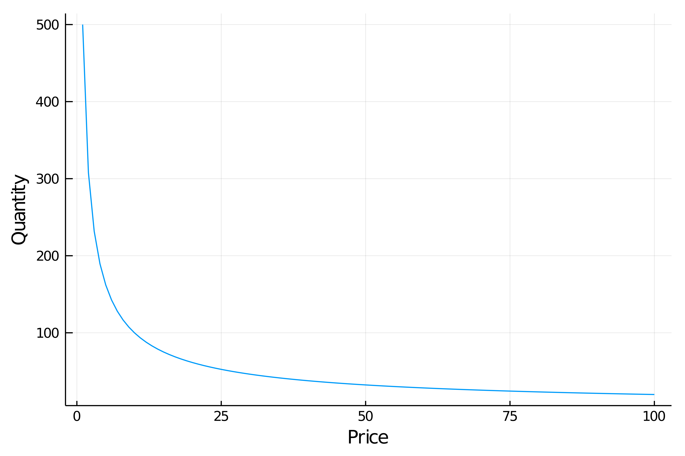
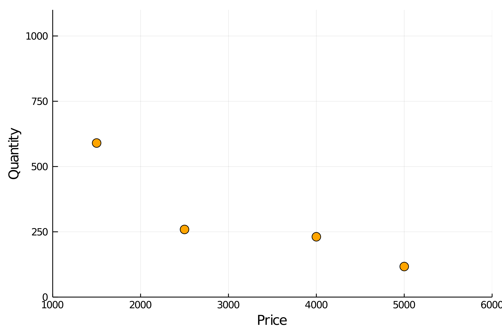
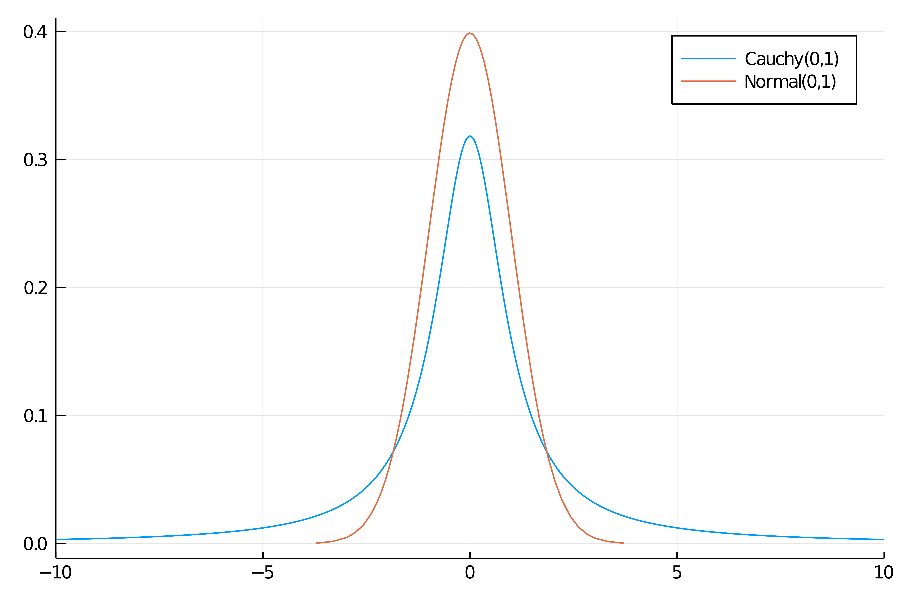
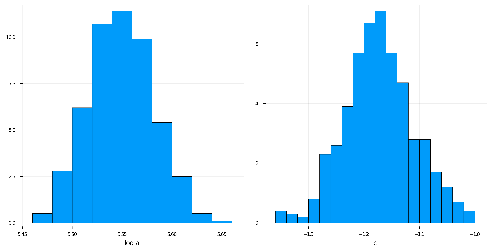
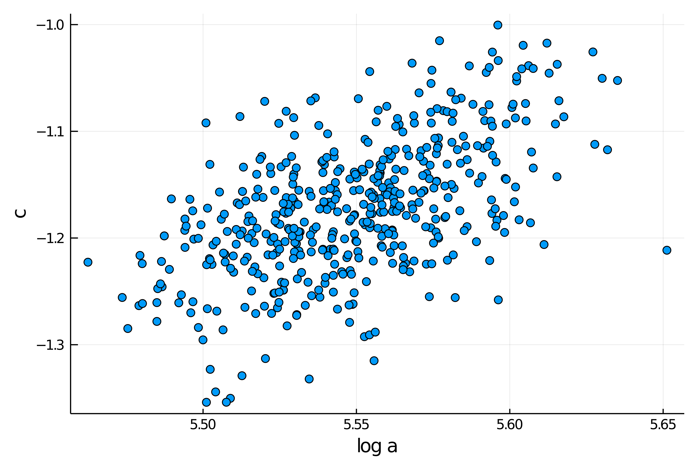
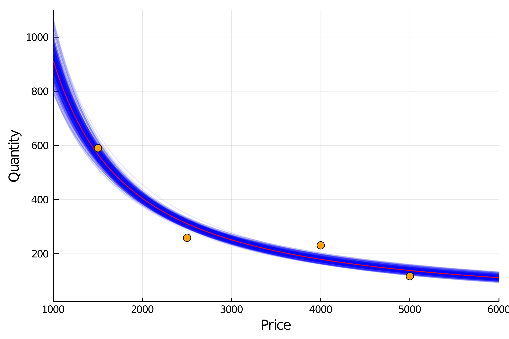
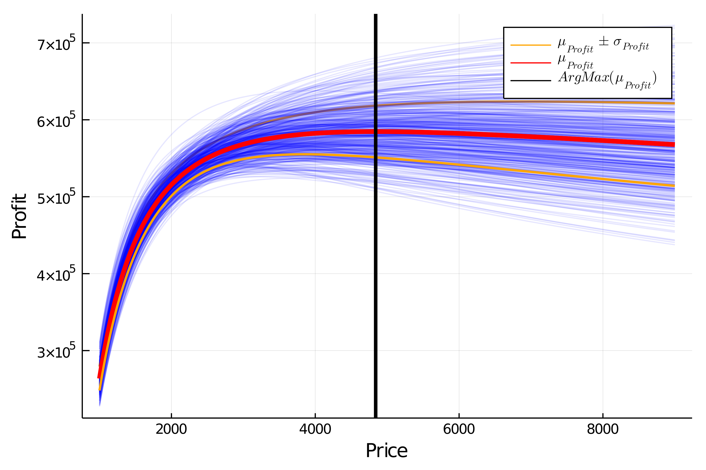

# Overview

In a bayesian framework we can work intrinsically with the uncertainty of the data. It allows us to include it in our models. This is especially beneficial when we want to take a decision based on the results of a model. In this type of problem, if we optimize the expected value of the function we want to maximize, we obtain just a number, losing all the information and richness uncertainty can give us.

In real-life scenarios, when making decisions we almost never have all the necessary information and therefore we have to deal with uncertainty. So it's important to be able to take into account how certain we are of the information we have. It may be the case that the value that maximizes (or minimize) certain problem comes with a lot of uncertainty so would be more appropriate to choose other with a better optimization-uncertainty trade off.

Bayesian inference allows us to do this because of it approach of a statistical problem. From its point of view, the data obtained on an event is fixed. They are observations that have already happened and there is nothing stochastic about it. So the data is deterministic.

On the contrary, the parameters of the models we propose to describe such data are stochastic, following a given probability distribution. In this way, the inference that is made is on the complete distributions of our parameters, which allows us, precisely, to include the uncertainty into our models.

## Optimal pricing

---------------
Pricing a product is not an easy task. Multiple factors intervene in a customer's decision to buy a product. Also, a price can be fixed for some unknown business' decision. Now suppose you have a new product you want to introduce in the local market and you need to set a price for it. Also, as a businessman, you want to have the maximum profit.

If the kind of product you intend to produce were already in the market, you could use this information to have an initial guess. If the price is too high, you probably won't sell much. Conversely, if it’s too low, you probably sell more, but since the production process have an associate cost, you have to be careful and take it into account when you do the math.

### Price vs Quantity model

We are going to use a known equation to model the relationship between price of a product and the quantity demanded, the equation (1). The figure 1 show it's behavior for some value of *a* and *c*. This equation tell us that the higher the price, the less we sell, and  if we continue rising the price, eventually our product it's so expensive that nobody is interested.

<div style="text-align:center">Q=aP<sup>c</sup> (1)</div>

<figure class="image">
<div style="text-align:center"></div>
<figcaption style="text-align:center">Figure 1. Quantity vs Price model.</figcaption>
</figure>

You can imagine this as when you buy a luxury bread at the bakery:

In the beginning, if the price of this bread is very low and you will surely buy many of them, even giving some away so that others can try them. If one day you wake up and see that the price of this tasty bread is now double, you will surely stop buying too much and just concentrate on having it for a nice breakfast. Now, if a couple of months later the bakery became famous thanks to its delicious bread and they decided to sell it five times more expensive than before, you would start looking for another bakery.

#### Power law distributions

Okay, so we agree that our model has to express that as the price goes up the quantity tends to go down. However, one could ask why use a decreasing exponential function and not another one, for example a linear relationship with a negative slope.

The answer to this question is not straightforward. To start building an intuition, we must think about how people's income is distributed.

Surely many of you have the main idea: income is not distributed equally across the population.

In general, a few people concentrate most of the income, and only a little of the income is distributed in the majority of the population. The distributions that describe this phenomenon are called "power law". The best known is perhaps the Pareto distribution or 80-20 distribution. A distribution widely used in business management referring to the fact that, for example 20% of the mix of products sold are those that generate 80% of the profits.

In economics this idea is presented with the Lorentz curve:

<figure class="image">
<div style="text-align:center"></div>
<figcaption style="text-align:center">Figure 1. Lorentz curve. A graphical representation of income inequality.  </figcaption>
</figure>

In this graph, the x-axis represents the accumulated population and the y-axis the accumulated income. Reading from left to right and as you move along the x-axis, more and more income is accumulated by fewer people. For example, the first 10% of the population barely accumulates 1% of income while the richest 10% on the right is accumulating 40%. An ideal society with a perfectly distributed income would have a straight 45º Lorentz curve.

With this in mind we can already generate an intuition that will help us answer the initial question: why use a decreasing exponential and not a negative-slope line?

Well, since a great majority of people have a small relative income and a minority has a large one, as we increase the price of the product, a large number of people with low income can no longer afford it. This process continues until only people with a high income are left and their consumption preferences are not greatly affected by the price increase.

The exponential distribution is useful to describe this.

### Price elasticity of demand

A very important factor to consider is the price demand elasticity of the product in question. What does this mean? It means how much the quantity that customers demand of my product changes when I change the price of the product by one unit.

Mathematically, price elasticity is defined as:

$$e_{(p)}=\frac{dQ/Q}{dP/P}$$ (1)

For example, the demand elasticity of a medicine for a terminal illness is not the same as that of chocolate with peanuts.

While some might argue that chocolate is vital to your life, the difference between these two products is that users of the medicine cannot afford not to consume it. No matter how much the price increases, the nature of their need forces them to buy it anyway. It is said then that the medicine has a low demand elasticity, that is, it is not sensitive to price.

<figure class="image">
<div style="text-align:center"></div>
<figcaption style="text-align:center">Figure 1. Inelastic demand of an important medicine. As it is vital for life the price hardly affects the quantity demanded.</figcaption>
</figure>


On the contrary, if we see that the price of chocolates goes up a lot, we will probably stop consuming it, since it is not vital for our health. Well, that's relative.

<figure class="image">
<div style="text-align:center"></div>
<figcaption style="text-align:center">Figure 1. Posible demand curve for non chocolate lovers. As the price goes up the quantity goes down a lot.
</figure>

Perhaps you are wondering the importance of being able to have clarity about the elasticity of a product. To explain it, let's remember that the sales (in money) we get when trading a product are calculated:

<div style="text-align:center">Sales = Quantity x Price (2)</div>
</div>

So it is vitally important to analyze how much one variable varies when moving the other.

It is evident that in the case of inelastic goods, it is always convenient to raise the price in terms of increasing the profit. On the other hand, when we work with a good that has some kind of elasticity, the increase generated by setting a higher price can be offset by an even greater drop in the amount sold. So we have to understand very well that behavior in order to define the optimal price level.

#### Dealing with uncertanty

Anyway, if our product is a new idea, the problem depicted above gets a lot more complicated if the product is brand new, an invention, and the approach it's different. That's be the problem we are about to solve:

Suppose you are about to release a completely new and disrupting product. Your product is so different that you don't have others to compare with, at least in the local market, so you are not sure about what price to choose. You don't want to lose money of course, so you want the maximum profit you could get. To test the waters, a common choice is to run a pilot test, offering your product at different prices and see how customers react. So you record how much you sell at what price, but how do we proceed?


In our problem, we said we have already recorded some points of the curve for our product. And to do it we simply run the pilot test, fixing a price and counting the amount of product we sold. We can infer employing this data the “demand curve”, then we can propose a profit function for the new product and finally find the price that maximizes our profit. In the figure 2 we plot the points recorded in the pilot test. At first sight they seem to follow the expected relationship but it is not a perfect curve, right? They have some kind of "noise". Well, after all we could say that the reality is noisy.

<figure class="image">
<div style="text-align:center"></div>
<figcaption style="text-align:center">Figure 2. Data of Quantity and Price recorded.</figcaption>
</figure>

Now, given the model and the data available, we define it

So, given our exponential model to describe the relationship between the price of a good and the quantity demanded, We want to estimate its parameters:

$Q=aP^{c} $

In order to do this, an intelligent strategy is to linearize the relationship in order to perform a simple linear regression. Simply taking the logarithm of both parts of the equation achieves the goal:

$Log(Q)=Log(a) + cLog(P) $

Now, the only thing left to do is to define the model in a bayesian framework for Julia, called Turing, which is used to do probabilistic programming.


```julia
@model function quantity(qval,p0)
	log(a) ~ Cauchy()
	c ~ Cauchy()
	logμ0_ = log(a) .+ c*(log.(p0) .- mean(log.(p0)))
	μ0_ = exp.(logμ0_)
	for i in eachindex(µ0_)
		qval[i] ~ Poisson(μ0_[i])
	end
end
```

How we interpret this model?

#### Priors: our previous knowledge

Remember that Bayesian models always ask us to choose previous distributions for their parameters. In this particular example we propose that *log a* and *c* follow a Cauchy distribution. *Why did we do this?* Basically they are very flat distributions that are going to leave a lot of freedom for turing to learn from the data what the value of the parameters are.

<figure class="image">
<div style="text-align:center"></div>
<figcaption style="text-align:center">Figure 2. Normal and Cauchy distributions. The Cauchy distribution is said to be fat tailed as it allows for extreme values.</figcaption>
</figure>

Doing this is the best choice? Definitely not. Having the possibility to choose the previous distributions allows us to introduce previous knowledge to our problem. For example, if you were doing a linear regression to find the relationship between people's weight and their height, you could already "tell" the model that it would not make sense for the relationship to be negative, that is, that it does not make sense that as a person weighs more, he or she would be shorter.

Another very important use of piors is to define the scale of the problem. In the example of height and weight it would be to say something like "It doesn't make sense that for every additional kilogram of weight, a person would measure one meter more. At most a few centimeters". All this information can be communicated to our model through the priors we choose. Let's leave it there for now.

Returning to the code. Julia allows us to easily define the variables that are probability distributions using the ~ operator. Once we know *c* and *log a* for a given value of price, we can univocally determine the quantity, therefore the variables $\log(\mu_0)$ (and $\mu_0$) are defined with the = operator, indicating a deterministic relation.

In addition, since the quantity of product sold is a discrete one and it comes from adding independent purchases, they are modeled as a poisson distribution.

But why do we subtract the mean for the price values?  It´s a good practice to avoid a common problem: multicollinearity. With multicollinearity, the models tend to be more certain about the plausible values of our model, meanwhile models with more normalized data are more conservative and they are less prone to overfitting, an unwanted effect we need to avoid if we expect our model to work good with new. As a rule of thumb, it is always good to standardize our data. That is, subtract their average and divide each by its standard deviation.

#### Updating our beliefs

As we said, in a bayesian framework our previous knowledge are the distributions we propose for each of the parameters and the relationship known between price and quantity.
With this bayesian approach, our previous knowledge are the distributions we propose for each of the parameters and the relationship known between price and quantity. What we do now is to update our believes, incorporating in our model the data points we have recoded from our pilot test as show in the code bellow, instantiating our model with the points *Quantity* and *Price*. Our model now has computed what is called the *posterior distributions* for the parameters *log a* and *c*, our updated believes for the plausible values for this two parameters.

```julia
model = quantity(Quantity, Price)
posterior = sample(model, NUTS(),1000)
```

<figure class="image">
<div style="text-align:center"></div>
<figcaption style="text-align:center">Figure 3. Posterior distributions for the parameters log a and c.</figcaption>
</figure>

To evaluate multicollinearity between the two parameters of our model, we plot the sampled values, one against the other. In the figure 4, we don't see a pattern, they seem to be decorrelated, therefore multicollinearity is not present in our model, so we are good to go and we can continue with the problem.

<figure class="image">
<div style="text-align:center"></div>
<figcaption style="text-align:center">Figure 4. Parameters c vs log a for sampled values from the posterior distributions.</figcaption>
</figure>

 We said that a plus of solving a problem using bayesian inference is that we can incorporate uncertainty in our model, so we can letter make better informed decisions. In the figure 5, we plot the lines corresponding to the different sampled values of *log a* and  *c* from our model. Since values of *log a* and *c* with higher probability will be sampled more often, the density of lines give us a sense of plausibility, and therefore we can evaluate the certainty (or uncertainty) of our model for a given value of price.

<figure class="image">
<div style="text-align:center"></div>
<figcaption style="text-align:center">Figure 5. Data recorded and models for sampled values of log a and c from the posterior distribution. </figcaption>
</figure>

## Maximizing profit

Now that we have estimated our posterior distributions, we will try to answer the following question: what is the price that will give us the maximum profit? To do that, first we need to define a profit function. This function will give us, for a given price and quantity, how much we will earn.
We will consider that the total cost of producing the product has two parts: a variable cost that depends on the quantity and a fixed cost that doesn't change with the production. The equation is shown below.

```julia
fixed_cost = 10000
k = 700
var_cost = k .* Quantity
total_cost = var_cost .+ fixed_cost
profit = Price * Quantity .- total_cost
end
```

Now we can plot the profit for many sampled values from the posterior distributions of our model and find the maximum.

<figure class="image">
<div style="text-align:center"></div>
<figcaption style="text-align:center">Figure 6. Profit for sampled values, highlighting the mean, a deviation from the mean and the maximum mean profit.</figcaption>
</figure>

The red line plotted is the mean expected profit and its maximum is near $4840. The region between the orange lines is approximately one standard deviation far from the expected value or where the 65% of the lines, plotted from the sampled values of our parameters, fall. In this case, for the maximum profit, we see that this value has more uncertainty than a more higher price.
